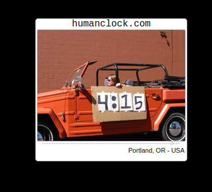
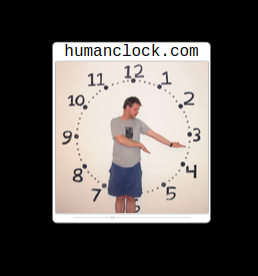

## MMM-HumanClock

A different kind of calendar. Photos contributed from all over the world.

## Examples

* Large or small. Digital or analog

  

## Installation

* `git clone https://github.com/mykle1/MMM-HumanClock` into the `~/MagicMirror/modules` directory.

## Config.js entry and options

```
    {
          disabled: false,
        module: "MMM-HumanClock",
        position: "middle_center",
        config: {
          size: "small", // small or large
          calType: "analog", // analog or digital
        }
      },
```

